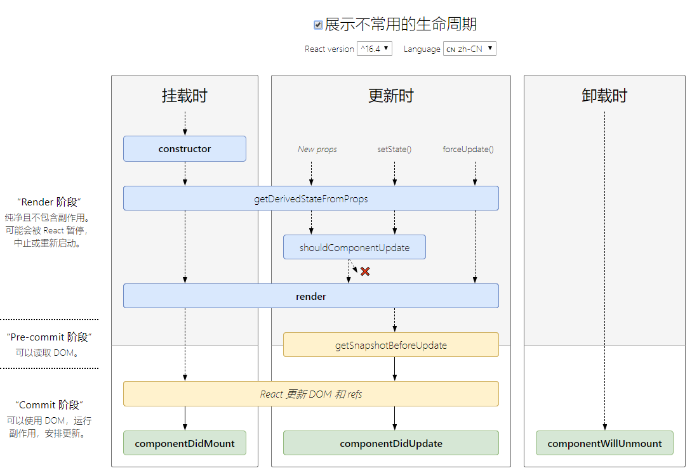

### React生命周期的四个阶段

1. `组件初始化阶段` ：也就是以下代码中类的构造方法 `constructor()` ，可以用来用来`初始化state属性`，Test类继承了react Component这个基类，也就继承这个react的基类，才能有render()、生命周期等方法可以使用，这也说明为什么函数组件不能使用这些方法的原因。
    ```javascript
    class Test extends Component {
        constructor(props) {
            super(props);
        }
	  }
    ```
2. `组件的挂载阶段`: 此阶段分为 `componentWillMount`，`render`，`componentDidMount` 三个时期。
    - `componentWillMount()` 在组件挂载到DOM前调用，且只会被调用一次，在这边调用this.setState不会引起组件重新渲染，也可以把写在这边的内容提前到constructor()中(很少使用)，`依赖于 DOM 节点的初始化应该放在这里,也可以在这里通过网络请求数据， 并且可以在这里添加事件`。
    - `render()` 根据组件的props和state, return 一个React元素, 不负责组件实际渲染工作，之后由React自身根据此元素去渲染出页面DOM。 `注意：render是纯函数,不能在里面执行this.setState,会有改变组件状态的副作用`
    - `componentDidMount()` 组件挂载到DOM后调用，且只会被调用一次
3. `组件的更新阶段`: 此阶段分为`componentWillReceiveProps`，`shouldComponentUpdate`，`componentWillUpdate`，`render`，`componentDidUpdate`
    - `componentWillReceiveProps(nextProps)` 此方法只调用于props引起的组件更新过程中, 此方法中根据nextProps和this.props来查明重传的props是否改变
	- `shouldComponentUpdate(nextProps, nextState)` 此方法通过比较nextProps, nextState和 this.props, this.State; 当返回True时调用render()重新渲染组件; 返回false则当前组件更新停止,通常用来优化组件性能
	- `componentWillUpdate(nextProps, nextState)` 此方法在调用render方法前执行, 这里可执行一些组件更新发生前的工作
	- `render()` 与组件挂载阶段的render()函数相同, 只是重新调用了一次
componentDidUpdate(prevProps, prevState) 组件更新后被调用, 可以操作组件更新的DOM, prevProps和prevState这两个参数指的是组件更新前的props和state
4. 组件的卸载阶段: `componentWillUnmount()`
    - 此方法在组件被卸载前调用, 可以在这里执行一些清理工作, 比如清楚组件中使用的定时器, 清除componentDidMount中手动创建的DOM元素等, 以避免引起内存泄漏.

### 16版本之前的生命周期图谱 & 当下生命周期图谱

- 16版本之前的生命周期图谱

- 现在的生命周期图谱


### 推荐阅读
- [react lifecycle methods diagram](http://projects.wojtekmaj.pl/react-lifecycle-methods-diagram/)
- [React.Component](https://zh-hans.reactjs.org/docs/react-component.html)
- [Update on Async Rendering](https://zh-hans.reactjs.org/blog/2018/03/27/update-on-async-rendering.html)