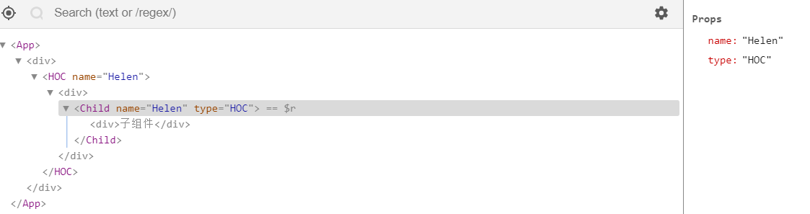

### 什么是高阶组件
- 官网介绍说，高阶组件（HOC）是 React 中用于复用组件逻辑的一种高级技巧。HOC 自身不是 React API 的一部分，它是一种基于 React 的组合特性而形成的设计模式。具体而言，**高阶组件是参数为组件，返回值为新组件的函数**。
- 简单点说，高阶组件其实就是处理react组件的函数

### 怎么使用高阶组件
- 实现高阶组件的方法有两种
    1. 属性代理（这种方法是最常见的实现方式，将被处理的props和新的props一起传递给新组件）
    2. 反向继承

### 举个栗子
- 属性代理

```
import React, { Component } from 'react'

function HOC(WrapperComponent){
    return class HOC extends Component {
        render() {
            const newProps = { type:'HOC' };
            return (
                <div>
                    <WrapperComponent {...this.props} {...newProps} />
                </div>
            )
        }
    }
}

export default HOC
```
```
import React, { Component } from 'react'
import HOC from './HOC'

class Child extends Component {
    render() {
        return (
            <div>
                子组件
            </div>
        )
    }
}

export default HOC(Child)
```
```
import React, { Component } from 'react'
import Child from './Child'

export default class App extends Component {
    render() {
        return (
            <div>
                <Child name='Helen' />
            </div>
        )
    }
}
```
- 页面上渲染出来的结构为


- 反向继承

```
function HOC(WrapperComponent){
    return class HOC extends WrapperComponent {
        getIt() {
            this.getMe();
            console.log('Catch You!')
        }
        componentDidMount() {
            this.setState({
                name: 'change Helen'
            })
        }

        render() {
            return super.render();
        }
    }
}

export default HOC
```

```
import React, { Component } from 'react'
// import Child from './Child'
import HOC from './HOC'

class App extends Component {
    constructor(props){
        super(props);
        this.state = {
            name: 'Helen'
        }
    }
    getMe() {
        console.log('Get me?');
    }
    render() {
        return (
            <div>
                {this.state.name}
                {this.getIt()}
            </div>
        )
    }
}

export default HOC(App)
```

- 查看页面显示结果

    - App中可以访问到getIt方法的原因是：在HOC中，`super.render()` super作为对象调用父类方法时，绑定的是子类的this，而getIt方法中之所以能访问到getMe是因为该类继承了App类，所以能使用App的所有属性和方法
