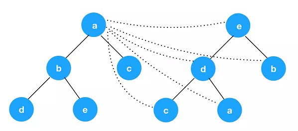
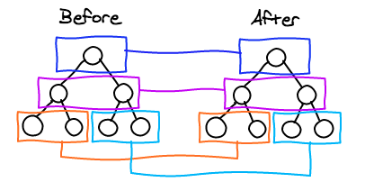

### 在谈React Diff之前，先看看传统的diff算法

- 如果要计算上图两个树形结构的差异并进行转换，传统diff算法会递归每一个节点，以a节点为例，会进行如下比较
    `a->e，a->d，a->b，a->c，a->a`
- 左侧树节点b，c，d，e比较过程与节点a相同，这时算法复杂度能达到O(n^2)，查找完差异后，还需计算最小转换方式，最终达到的复杂度为O(n^3)

### React Diff策略

- 传统diff算法的复杂度为O(n^3)，显然这是无法满足性能要求的，React通过制定大胆的策略，将复杂度从O(n^3)降低到了O(n)，它的diff策略主要集中在三个点上
    1. Web UI中DOM节点跨层级的移动操作特别少，可以忽略不计，`所以react实现的diff是同层级比较`
        
        - React只会对相同颜色方框内的DOM节点进行比较，即同一个父节点下的所有子节点。当发现节点已经不存在，则该节点及其子节点会被完全删除掉，不会用于进一步比较。这样只需要对树进行一次遍历，便能完成整个DOM树的比较
    2. 拥有相同类的两个组件将会生成类似的树形节点，拥有不同类的两个组件将会生成不同的树形结构
    3. 对于同一层级的一组子节点，它们可以通过唯一id进行区分

### 推荐阅读
- [知乎：React 源码剖析系列 － 不可思议的 react diff](https://zhuanlan.zhihu.com/p/20346379)
- [React diff算法](https://www.jianshu.com/p/a2cc22779ec8)
- 英文原文 [React’s diff algorithm](https://calendar.perfplanet.com/2013/diff/)

